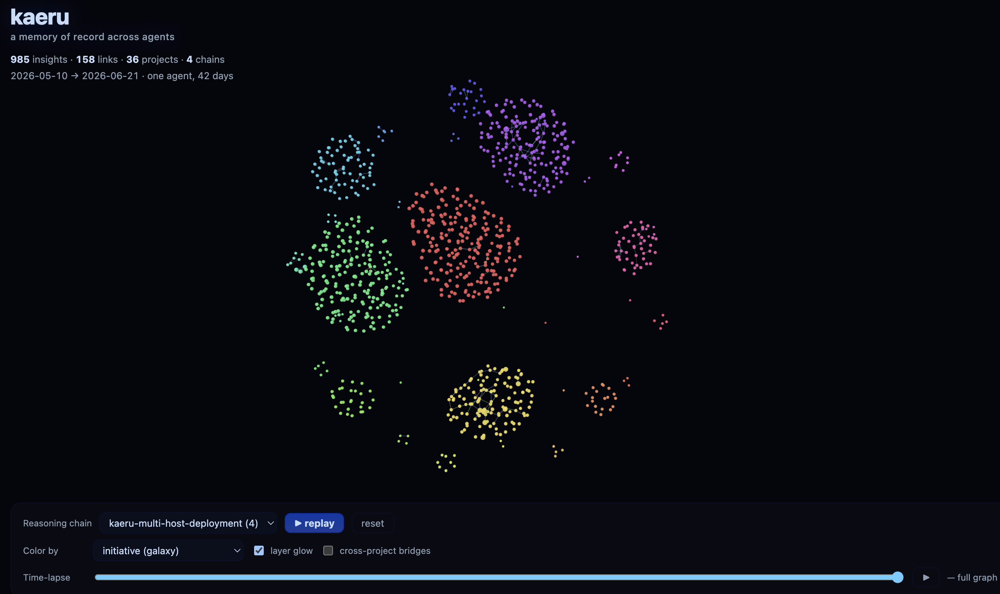

# 蛙 kaeru

`kaeru` is a **cross-agent cognitive engine** for LLM agents — a typed graph that agents think in, plus a recollection layer for long-term ideas and outcomes. Local-first for each agent, with an optional shared cloud tier so a whole team of agents and people build on one another's memory.

Designed for **multi-session, multi-agent continuity**: when an agent opens a project, it has full context of what was being thought about, can follow provenance chains, can consolidate outcomes into stable long-term knowledge, and can pull in what the rest of the team has shared.

Inspired by the LLM-wiki pattern (Karpathy, gist `442a6bf555914893e9891c11519de94f`), the bi-temporal knowledge graph approach of Graphiti / Zep, the curator-driven knowledge engine of Cognee, and the reasoning-based hierarchical-summary navigation pattern from PageIndex. Two-tier design grounded in the hippocampus / cortex split.

Name: 蛙 (*kaeru*, "frog"; homophonic with 帰る "to return" and 変える "to change") — the agent that returns, recalls, and reshapes.


<sub>A kaeru vault rendered by [`kaeru-viz`](kaeru-viz/) — each project a constellation of stars around its core, sized by memory layer, with ochre cross-project bridges, reasoning-chain replay, and a time-lapse of how the knowledge grew. Hover a node to trace its neighbours; click to pin them.</sub>

## Overview



`kaeru` is built around a typed property graph stored in CozoDB. Two tiers, biological analogy:

- **cognitive (operational / hippocampus)** — high-velocity working graph where the agent actively thinks: episodes, scratch, drafts, hypotheses, experiments, audit events.
- **recollection (archival / cortex)** — settled ideas, outcomes, summaries, references; mostly read.

Every node and edge is **bi-temporal** — the substrate stores assertion / retraction history natively, so time-travel queries are out of the box and conflict resolution is non-destructive (the old version is invalidated, not deleted).

Per-initiative subgraphs through a junction-relation pattern: one substrate, many initiatives, multi-membership. An agent working on project A asks "what was I doing here last time?" and gets an answer scoped to A. The same node can belong to several initiatives at once.

`kaeru` is a **facilitator, not an enforcer**. The curator API exposes ~40 primitives (`awake`, `recall`, `drill`, `claim`, `synthesise`, `at`, `history`, `consolidate_out`, …) as available tools. The agent and user choose when to invoke them; the daemon hints but doesn't block.

## Features

- **Two-tier graph** — operational (cognitive / hippocampus) for active thinking; archival (recollection / cortex) for settled knowledge. `consolidate_out` promotes across the boundary, preserving provenance.
- **Bi-temporal** — native assertion / retraction history. `at` reads a node in full as it is now or as-of any past moment; conflicts are non-destructive (the old version is invalidated, not deleted).
- **Per-initiative scoping + layered re-entry** — one substrate, many projects. `awake` restores a project's working set by memory layer (Core → Hot → Warm) and surfaces the archival **cortex** (settled knowledge) alongside it, so durable facts re-enter every session; `surface` reaches the archived Cold / Frozen on demand.
- **Reasoning chains** — `chain` saves the load-bearing weighted path between two nodes as a recallable trail with an agent-authored summary; `chains` triages by name + summary, duplicates are folded at creation, and `rechain` refreshes a trail after the graph changes (re-links, re-weights).
- **Self-maintenance** — `reflect` computes a tidy-up work-list: orphan nodes to link, chains gone stale, settled work to promote into cortex, and shared/cloud items whose rebalancing is escalated to the user. Built for a periodic (cron) pass.
- **Cross-agent sharing** — local-first by default; an optional `kaeru-cloud` tier lets a trusted team share settled knowledge through two safety gates (initiative policy + a deterministic secret guard). See [Local & cloud](#local--cloud--sharing-memory-across-a-team).
- **Structural recall** — exact name lookup, typed `walk` / `drill` / `trace`, `between`, FTS fuzzy fallback. Every read also carries when each node was asserted. Recall is structural + full-text; there is no vector/embedding layer today.
- **Initiative management** — `rename` / `delete` an initiative (locally or team-wide), or `attach` a node to another initiative to repair fragmentation after the fact.
- **Markdown export** — Obsidian-friendly snapshot of any initiative.

## Architecture Notes

- **Substrate is CozoDB** with RocksDB backend; bi-temporal `Validity` is native to the substrate, not bolted on.
- **Edges carry operational semantics** — each edge type is something the curator API responds to. `derived_from` powers provenance and explainability; `contradicts` triggers a non-destructive `under_review` flow; `supersedes` retracts the previous version through the bi-temporal substrate. Edges are not just associations.
- **`audit_event` is a first-class node type** — every mutation writes an audit node, so changes to memory themselves become reasoning surface for the agent. Substrate-level history (`Validity`) and operational audit (audit-event nodes) stay separate: the substrate tracks *what was*, the audit nodes track *who did it and why*.
- **Per-initiative scope through junction relations** rather than column filtering — RocksDB prefix-scan gives O(log n + k) on the active initiative.
- **Retrieval is structural-first** — explicit name lookup, typed graph traversal, summary views. Cozo FTS for fuzzy fallback when an exact name is forgotten. No vector/embedding layer today: Cozo supports HNSW, but kaeru wires none of it — a vector fallback is possible future work, not a current feature.
- **Two-tier with explicit `consolidate_out`** — operational drafts get promoted to archival as a deliberate, logged operation. Provenance (`derived_from`) survives the tier boundary.
- **Single binary, embedded substrate** — `kaeru` runs in-process with the agent. No server, no network. Vault on disk under a platform-specific default (Linux `$XDG_DATA_HOME/kaeru`, macOS `~/Library/Application Support/ai.lamantin.kaeru`, Windows `%LOCALAPPDATA%\ai.lamantin.kaeru`); override with `KAERU_VAULT_PATH`.

## Layout

```
kaeru/
├── Cargo.toml                  ← workspace root
├── kaeru-core/                 ← library: substrate, schema, primitives
├── kaeru-mcp/                  ← binary `kaeru-mcp`: Model Context Protocol server (the agent's surface)
├── kaeru-cloud/                ← binary `kaeru-cloud`: shared cloud tier (Axum REST over kaeru-core)
├── kaeru-rig/                  ← library: `rig` Tools that give a rig agent kaeru memory
└── skills/
    └── kaeru-skill/            ← portable agent skill (Claude Code / etc.)
```

`kaeru-rig` is the [rig](https://github.com/0xPlaygrounds/rig) framework adapter — the full curator verb set as discrete rig `Tool`s over an embedded `Arc<Store>`, so a rig agent reads and writes one vault. Future: `kaeru-langchain` (Python bridge), not yet started.

## Install

> **Pre-1.0 alpha.** Substrate schema may change between minor versions —
> export to markdown if you need to keep notes around.

See [QUICK_START.md](QUICK_START.md) for source builds, MCP daemon setup, and the re-entry ritual.

## Quick tour (MCP tools)

```
# See what projects exist:
initiatives

# Re-entry ritual: process state + epistemic state.
awake (initiative: "auth-rewrite")
overview (initiative: "auth-rewrite")

# Capture (auto-named):
jot (initiative: "auth-rewrite", body: "noticed token expiry differs across platforms")

# Fuzzy lookup when you forgot the exact name:
search (initiative: "auth-rewrite", query: "expiry")

# Drill into something:
drill (initiative: "auth-rewrite", name: "noticed-token-expiry-differs-across-...")

# Hypothesis cycle:
claim (initiative: "auth-rewrite", body: "platform-aware policy is correct", about: "<node>")
test (initiative: "auth-rewrite", hypothesis: "<hyp>", method: "compared iOS / Android TTL")
confirm (initiative: "auth-rewrite", hypothesis: "<hyp>", by: "<experiment>")

# Time-travel:
at (initiative: "auth-rewrite", name: "<name>", when: "5m")
history (initiative: "auth-rewrite", name: "<name>")

# Knowledge chains — strongest weighted path between two nodes
# (link the load-bearing edges with strong: true first):
path (initiative: "auth-rewrite", from: "<a>", to: "<b>")    # preview the trail
chain (initiative: "auth-rewrite", from: "<a>", to: "<b>")   # save it as a recallable chain

# Snapshot to an Obsidian-friendly markdown vault:
export (initiative: "auth-rewrite", path: "/tmp/auth-snapshot")
```

## Connecting to an MCP-aware agent

`kaeru-mcp` is a long-lived HTTP service: **one daemon per machine** owns the substrate, any number of agent sessions (Claude Code, Opencode, Cursor, …) connect concurrently. This is intentional — RocksDB is single-writer, so a stdio MCP that forks a subprocess per session would hit lock contention. See `kaeru-mcp/README.md` for systemd / launchd unit templates and the full HTTP config.

Run the daemon (or set up the systemd user unit from `contrib/install/`):

```bash
kaeru-mcp                                            # foreground, Ctrl-C to stop
```

Then point your agent at it:

- **Claude Code**: `claude mcp add --transport http kaeru http://127.0.0.1:9876/mcp` — see `skills/kaeru-skill/` for the portable system-prompt rules.
- **Opencode**: `bash contrib/opencode/install-opencode.sh` — wires the daemon, drops `AGENTS.kaeru.md` rules into `~/.config/opencode/`, and installs `/kaeru` / `/lesson` / `/recall` slash commands. Designed to coexist with your existing OSS-model provider config (Qwen / DeepSeek / GLM / Ollama). See `contrib/opencode/README.md`.
- **Cursor and other runtimes**: paste the body of `skills/kaeru-skill/SKILL.md` into your agent's rules / system-prompt section. For MCP-aware clients the daemon URL above works directly.

After restart the agent sees tools like `awake`, `drill`, `claim`, `at` natively. Each tool takes an optional `initiative` parameter.

## Local & cloud — sharing memory across a team

`kaeru` runs **local-first**: your vault lives on your machine and nothing leaves it by default. A second, optional tier — `kaeru-cloud` — is a shared store for a trusted group (a team, a family). Each initiative carries a sticky `share_policy`:

- `private` (default) — nothing ever leaves; personal projects.
- `team` — nodes you explicitly mark `shared` may sync to the cloud.

Sharing is never automatic and passes two gates: the initiative policy, and a deterministic **pre-share secret guard** that blocks anything looking like an API key, token, or private key. The guard is silent on clean content and only interrupts on a real hit.

Verbs (over MCP): `policy` (mark an initiative `team`), `share` (push a node), `cloud_recall` (see what the team has), `pull` (bring a shared node into your local graph), `link_cloud` / `cloud_links` (reference cloud nodes without copying), and `sync_review` (batch-review still-local nodes). Capture verbs (`episode` / `jot` / `cite`) take `visibility: shared` to capture-and-share in one call.

A single daemon can also reach **several named clouds** (e.g. a `family` and a `work` cloud) via a `clouds.toml` file; the cloud verbs then take an optional `cloud: <name>` and soft links remember which cloud they point at. See [`kaeru-mcp/README.md`](kaeru-mcp/README.md#configuration) for the file format.

Per-user / per-org isolation (multi-tenant) is a future addition; today each cloud is one shared space scoped by initiative. See [`kaeru-cloud/README.md`](kaeru-cloud/README.md).

## Roadmap

- **Initiative onboarding** — a generated "what is this initiative, and what's in it" briefing the first time an agent enters a project, in the spirit of the `import` guide — an instruction over the collected context, not graph machinery.
- **PostgreSQL backend** — a server-mode substrate alongside the embedded RocksDB default.
- **Multi-tenant + isolation** — per-user / per-org separation in the shared cloud.
- **Cross-initiative links** — edges and recall that span initiatives (everything is initiative-scoped today).

## Status

Pre-1.0. Implemented and covered by a green test suite: the substrate and curator API, memory layers with layered re-entry — an operational working set plus an archival **cortex** that re-enters every session (`awake` / `surface`), bi-temporal time-travel with assertion time surfaced in every read (`at` / `history`), per-initiative scoping with `rename` / `delete` / `attach` (additive multi-membership), knowledge chains (weighted shortest-path, agent-authored summaries, creation-time dedup, `rechain`), a `reflect` maintenance pass, forward-only schema migrations, the MCP server, the shared `kaeru-cloud` tier (sharing, recall, soft links, sync-review) including multi-cloud, the `kaeru-rig` framework adapter (full curator toolset as rig Tools), and markdown export. What still needs hardening:

- **Multi-tenant.** The cloud is one shared space scoped by initiative; per-user / per-org isolation isn't built yet.
- **MCP concurrency.** Concurrent sessions share one `Store`; the per-call initiative scope is serialized through `Store::scoped`, so two sessions can't corrupt each other's scope. What remains is ordering — when an agent batch-fires async calls, a read can still land before a not-yet-applied write.
- **Whole-second `Validity` resolution.** Two opposing mutations on the same node/edge within one second (e.g. `link` then an immediate `unlink`, or a `forget` right after a write) resolve ambiguously. Interactive use is fine — human pacing always crosses the boundary; the test suite sleeps between such operations.
- **Audit events** aren't attached to the initiative junction yet (export filters them by `affected_refs` intersection — a working workaround).
- **Rig adapter shipped, LangChain not yet.** `kaeru-rig` gives a [rig](https://github.com/0xPlaygrounds/rig) agent the full memory toolset; a Python / LangChain bridge is still to come.
- **Migrations are forward-only and add-only.** A `migration_journal` runs schema additions (new relations / columns) on open; there is no down-migration or destructive-change path yet. Snapshot via `export` before a major upgrade is still prudent pre-1.0.

## Contributing

Discussion and design feedback through issues. PRs welcome on the open items above and anywhere the agent-facing surface feels rough — the verb taxonomy (`awake`, `drill`, `claim`, `flag`, `settle`, …) is meant to map to natural agent thinking, not just expose graph operations.

## License

MIT — see `LICENSE`.
